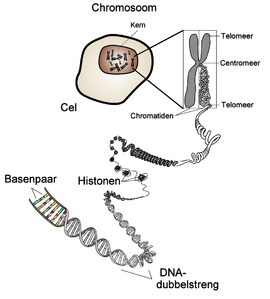
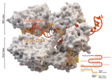

# DNA Editing
---
## Wat is DNA

+++
DNA staat voor Desoxyribonucleïnezuur, en is de belangerijkste drager van erfelijke informatie
+++
Verder werd DNA ontekt door Johann Fredrich Miescher in 1869

+++
en bestaat uit een dubbele helix van twee RNA strengen die met elkaar verbonden zijn door waterstofbruggen
+++

+++
op een cromosoon bevinden de genen zich, een gen heeft een of meer DNA-sequenties
---
## Maar warom moeten wij dit weten?
+++
### daar komen we nu toe
+++
## CRISPR
+++
CRISPR is de afkorting van Clustered Regularly Interspaced Short Palindromic Repeats en helpt tegen virussen
+++
CRISPR kan samen met Cas-9 gebruikt worden om gericht dna te bewerken
---
## Wat is Cas-9?
+++
### stop met vragen te stellen die toch binnen 5 minuten beantwoord worden.
+++
Cas-9 oftewel CRISPR associated proteine 9 is een RNA gestuurde DNA-Bewerker geassocieerd met het CRISPR-immuumsysteem.
en kan de effecten van DNA bewerkende virussen ongedaan maken.
+++

---
## Maar wij kunnen Cas-9 toch niet aansturen?
+++
### 1) Cas-9 kan heel makkelijk aangestuurd worden om aangepaste bewerkingen te maken.
### 2) Kan ik gewoon doorgaan met mijn presentatie
+++
Cas-9 kan.
1) Cas-9 heeft de mogelijkheid om genen te deactiveren dan verstoort Cas-9 de normale wering van dat gen
2) Cas-9 kan dit laatste paren met het invoegen van genen.
dit tweede zorgt ervoor dat we een gen effectief kunnen veranderen
---
## is dit wel ethsich verantwoord
+++
De ethische verantwoording hangt af van de situatie.
Als de vraag is dat we bijvoorbeeld ziektes zoals kanker kunnen stoppen is dit een goed gegeven
Aan de andere kant kunnen we dan ook mensen samenstellen(Ikea voor mensen), Of er is de mogelijkheid dat iemand met slechte bedoelingen een superdodelijk virus maakt.
---
# Vragen?
+++
# Vragen?
## Nee
+++
# Vragen?
## Nee, ok goed
---
# Bronnen
Wikipedia
[
