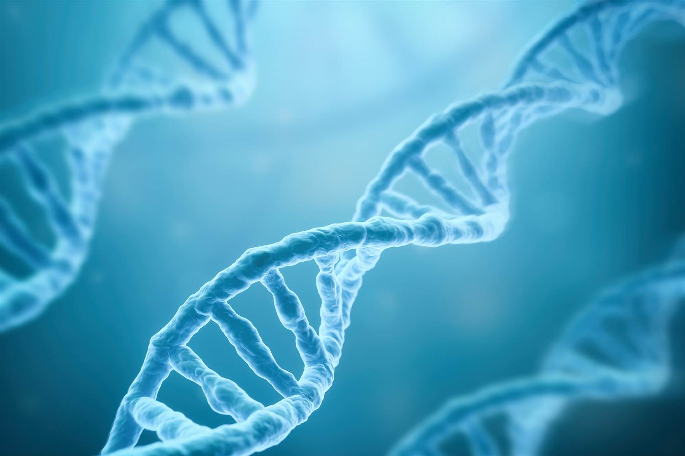
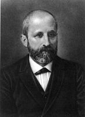

# DNA Editing
---
## Wat is DNA

+++
DNA staat voor Desoxyribonucleïnezuur, en is de belangerijkste drager van erfelijke informatie
+++
Verder werd DNA ontekt door Johann Fredrich Miescher in 1869

+++
DNA bestaat uit een dubbele helix van twee RNA strengen die met elkaar verbonden zijn door waterstofbruggen
+++

+++
op een cromosoon bevinden de genen zich, een gen heeft een of meer DNA-sequenties
